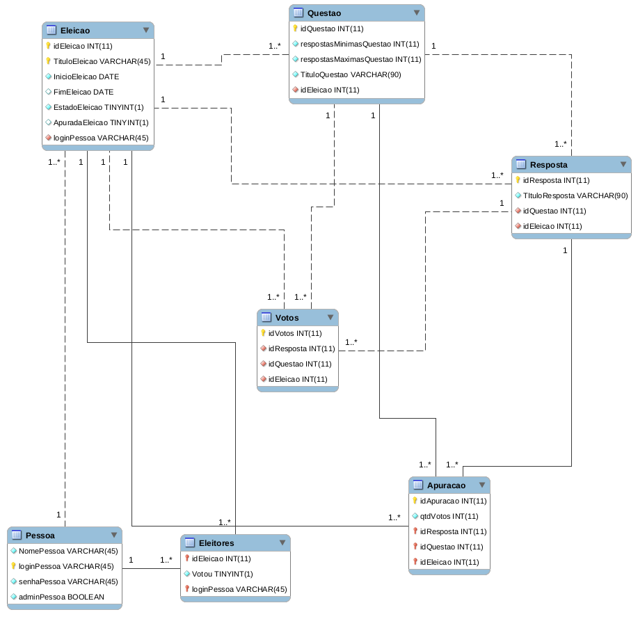

[](https://github.com/paulosell/BCD29008/blob/master/LICENSE)

# Projeto prático 02
Projeto desenvolvido para a disciplina de Banco de Dados (BCD29008) do curso de Engenheria de Telecomunicações do Instituto Federal de Santa Catarina - câmpus São José, ministrada pelo professor Emerson Mello.

# Schema do banco de dados
O _schema_ do banco de dados utilizado foi criado com o auxílio da ferramenta [_mySQL Workbench_](https://www.mysql.com/products/workbench/). A modelagem do banco pode ser conferida na figura abaixo.




# Funcionalidades implementadas no projeto

  * Criar eleição
  * Adicionar eleitores à eleição
  * Criar questão para eleição
  * Criar alternativas para questão
  * Abrir eleição
  * Fechar eleição
  * Apurar uma eleição
  * Exibir resultados de uma eleição
  * Votar
  
  # Considerações

* A eleição só poderá ser aberta no dia em que o usuário configurou
  
* Login e senha do usuário segue o padrão:
  ```
  login: emerson
  senha: senhaemerson
  ```

* Apenas adminstradores podem gerenciar eleições. 

* Já existe uma eleição aberta para voto e uma eleição fechada, com resultados apurados para verificação.

